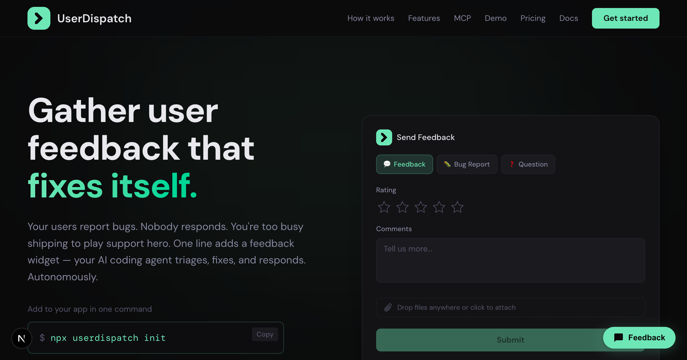

<p align="center">
  <picture>
    <source media="(prefers-color-scheme: dark)" srcset=".github/assets/logo-light.svg" />
    <source media="(prefers-color-scheme: light)" srcset=".github/assets/logo-dark.svg" />
    
  </picture>
</p>

<h3 align="center">UserDispatch <sup></sup></h3>

<p align="center">
  <a href="https://www.npmjs.com/package/userdispatch"></a>
  <a href="https://www.npmjs.com/package/userdispatch"></a>
  <a href="https://userdispatch.com"></a>
  <a href="https://userdispatch.com/docs"></a>
  <a href="./LICENSE"></a>
</p>

<p align="center">
  Add a feedback widget to any web app in one command.<br />
  Your AI coding agent triages feedback, drafts PRs, and responds to users — via MCP.
</p>

<p align="center">
  
</p>

---

## Quick start

```bash
npx userdispatch init
```

One command does everything:

- **Installs a feedback widget** in your app (auto-detects framework)
- **Creates your org & app** on userdispatch.com
- **Configures your AI coding agent** with the MCP server
- **Sends a test submission** to verify the full loop

Requires Node.js 18+. Full CLI reference: [userdispatch.com/docs/cli](https://userdispatch.com/docs/cli)

## How it works

```
┌─────────────┐     ┌──────────────────┐     ┌─────────────────┐     ┌──────────────┐
│  1. User     │────▶│  2. Agent reads   │────▶│  3. Agent drafts │────▶│  4. Weekly    │
│  submits     │     │  via MCP          │     │  PRs, replies,   │     │  digest       │
│  feedback    │     │                   │     │  triage          │     │  summary      │
└─────────────┘     └──────────────────┘     └─────────────────┘     └──────────────┘
```

1. **User submits feedback** — the widget captures feedback, bug reports, or questions with browser metadata and file attachments
2. **Agent reads via MCP** — your coding agent pulls new submissions using the `list_submissions` and `get_submission` tools
3. **Agent proposes** — triages issues, updates statuses, sends replies via email, and opens PRs informed by feedback patterns
4. **Weekly digest** — the `weekly-digest` prompt generates a 7-day summary of submissions, trends, and actions taken

## Framework support

The CLI auto-detects your framework and injects the widget into the right file.

| Framework | Auto-detect | Widget injection |
|-----------|:-----------:|------------------|
| Next.js (App Router) | Yes | `<Script>` in `app/layout.tsx` |
| Next.js (Pages Router) | Yes | `<script>` in `pages/_document.tsx` |
| Vite | Yes | `<script>` in `index.html` |
| Create React App | Yes | `<script>` in `public/index.html` |
| Nuxt | Yes | Manual (`nuxt.config.ts` shown) |
| SvelteKit | Yes | `<script>` in `src/app.html` |
| Astro | Yes | Manual (instructions shown) |
| Static HTML | Yes | `<script>` in `index.html` |

Override with `--framework <type>`. Full guide: [userdispatch.com/docs/widget](https://userdispatch.com/docs/widget)

## MCP server

UserDispatch hosts the MCP server at `https://userdispatch.com/api/mcp`. The CLI configures this automatically — or add it manually:

```json
// .mcp.json (Claude Code, Cursor)
{
  "mcpServers": {
    "userdispatch": {
      "url": "https://userdispatch.com/api/mcp",
      "headers": {
        "Authorization": "Bearer ${USERDISPATCH_TOKEN}"
      }
    }
  }
}
```

### Agent compatibility

| Agent | Config file | Auto-configured |
|-------|-------------|:---------------:|
| Claude Code | `.mcp.json` | Yes |
| Cursor | `.cursor/mcp.json` | Yes |
| Windsurf | `~/.codeium/windsurf/mcp_config.json` | Yes |
| VS Code Copilot | `.vscode/mcp.json` | Yes |
| Codex | `.codex/config.toml` | Yes |
| Claude Desktop | `claude_desktop_config.json` | Yes |

### Tools (17)

| Tool | Description |
|------|-------------|
| `list_submissions` | List submissions with filters (app, type, status, date, search) |
| `get_submission` | Get full submission details with attachments and replies |
| `update_submission` | Update submission status |
| `reply_to_submission` | Send a reply via email or dashboard |
| `delete_submission` | Permanently delete a submission |
| `list_apps` | List all registered apps |
| `create_app` | Create a new app |
| `update_app` | Update app settings |
| `delete_app` | Delete an app and all its submissions |
| `rotate_app_key` | Rotate an app's API key |
| `get_stats` | Get submission statistics |
| `get_org` | Get organization details |
| `update_org` | Update organization settings |
| `list_members` | List all organization members |
| `invite_member` | Invite a new member |
| `update_member` | Update member settings or role |
| `remove_member` | Remove a member |

Plus **5 resources** and **2 prompts** (`triage-submissions`, `weekly-digest`). Full MCP reference: [userdispatch.com/docs/mcp](https://userdispatch.com/docs/mcp)

## Widget customization

```html
<script
  src="https://userdispatch.com/widget.js"
  data-api-key="pk_your-api-key"
  data-position="br"
  data-trigger-label="Feedback"
  data-collect-email="true"
  data-collect-name="false"
  data-enable-logs="false"
  defer
></script>
```

| Attribute | Required | Default | Description |
|-----------|:--------:|---------|-------------|
| `data-api-key` | Yes | — | Your app's API key (starts with `pk_`) |
| `data-position` | No | `"br"` | Trigger button position: `"br"`, `"bl"`, `"tr"`, `"tl"` |
| `data-trigger-label` | No | `"Feedback"` | Text on the trigger button |
| `data-collect-email` | No | `"true"` | Show email field. Set to `"false"` to hide. |
| `data-collect-name` | No | `"false"` | Show name field. Set to `"true"` to enable. |
| `data-enable-logs` | No | `"false"` | Enable console log collector. Requires app-level setting. |
| `data-api-url` | No | Auto-detected | Override the API base URL. |

The widget renders in a Shadow DOM for full style isolation. Under 30KB gzipped. Full reference: [userdispatch.com/docs/widget](https://userdispatch.com/docs/widget)

## CLI reference

```bash
npx userdispatch init [flags]
```

| Flag | Description |
|------|-------------|
| `--token <token>` | Skip browser auth and use this `ud_` token directly. Auto-promotes to CI mode in non-TTY environments. |
| `--org <name>` | Organization name (skips prompt). |
| `--app <name>` | App name (skips prompt). Slug is auto-generated. |
| `--framework <type>` | Override framework detection. Values: `next-app`, `next-pages`, `vite`, `cra`, `nuxt`, `sveltekit`, `astro`, `static`. |
| `--agent <id>` | Override agent detection. Values: `claude-code`, `cursor`, `windsurf`, `claude-desktop`, `vscode`. |
| `--ci` | Non-interactive mode. Skips all prompts, uses defaults or flag values. |

Full CLI docs: [userdispatch.com/docs/cli](https://userdispatch.com/docs/cli)

## Security

UserDispatch is built with security at every layer — nonce-based CSP, SHA-256 hashed API tokens, PostgreSQL-backed rate limiting, Zod input validation, parameterized SQL, and constant-time token comparison. File uploads are validated by MIME type and magic bytes.

Full security architecture: [userdispatch.com/docs/security](https://userdispatch.com/docs/security)

To report a vulnerability, email [security@kiruna.ai](mailto:security@kiruna.ai). Please do not open public issues for security reports.

## Pricing

Every tier includes the full MCP server, all 17 tools, and the feedback widget.

| | Free | Pro | Team | Enterprise |
|---|:---:|:---:|:---:|:---:|
| **Price** | $0 forever | $9/mo | $49/mo | Custom |
| **Submissions/mo** | 100 | 250 | 2,500 | Unlimited |
| **Users** | 1 | 1 | 5 | Unlimited |
| **Apps** | 2 | 10 | Unlimited | Unlimited |
| **Data retention** | 3 months | Unlimited | Unlimited | Unlimited |
| **MCP server & 17 tools** | Yes | Yes | Yes | Yes |
| **Widget** | Yes | Yes | Yes | Yes |
| **Agent-sent emails** | Yes | Yes | Yes | Yes |
| **Log capture** | Yes | Yes | Yes | Yes |
| **Custom branding** | — | Yes | Yes | Yes |
| **Team roles** | — | — | Yes | Yes |
| **SSO** | — | — | — | Yes |

## Links

- [Website](https://userdispatch.com)
- [Documentation](https://userdispatch.com/docs)
- [Security](https://userdispatch.com/docs/security)
- [Privacy Policy](https://userdispatch.com/privacy)
- [Terms of Service](https://userdispatch.com/terms)

## License

[MIT](./LICENSE) — Kiruna Labs
